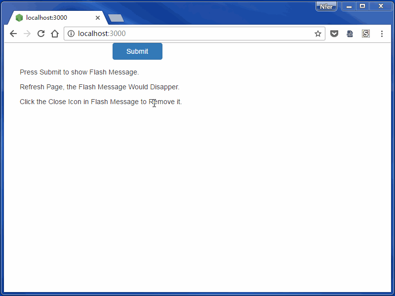

# express-flash-demo

A simplest express flash demo with bootstrap css style and font-awesome icon.


## Install

 - git clone / download this demo
 - npm install
 - node app.js
 - open http://localhost:3000/

## Core Code

app.js
```
const session = require('express-session');
const flash = require('express-flash');

app.use(session({
  resave: true,
  saveUninitialized: true,
  secret: 'Your Session Secret goes here',
  store: new session.MemoryStore
}));
app.use(flash());

app.post('/', (req, res, next) => {
  req.flash('errors', { msg: 'Error occurs.' });
  req.flash('info', { msg: 'This is an information.' });
  req.flash('success', { msg: 'Success!' });
  return res.redirect('/');
});
```

index.pug
```
      if messages.errors
        .alert.alert-danger.fade.in
          button.close(type='button', data-dismiss='alert')
            i.fa.fa-times-circle-o
          for error in messages.errors
            div= error.msg
      if messages.info
        .alert.alert-info.fade.in
          button.close(type='button', data-dismiss='alert')
            i.fa.fa-times-circle-o
          for info in messages.info
            div= info.msg
      if messages.success
        .alert.alert-success.fade.in
          button.close(type='button', data-dismiss='alert')
            i.fa.fa-times-circle-o
          for success in messages.success
            div= success.msg
```